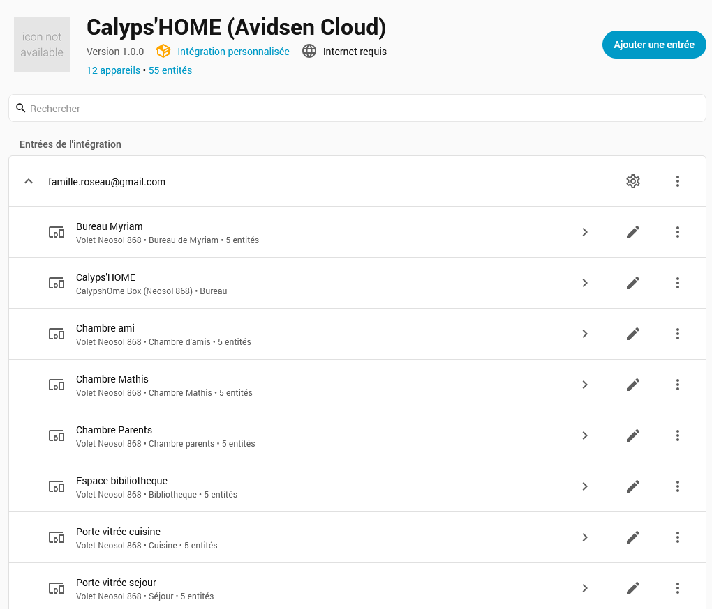
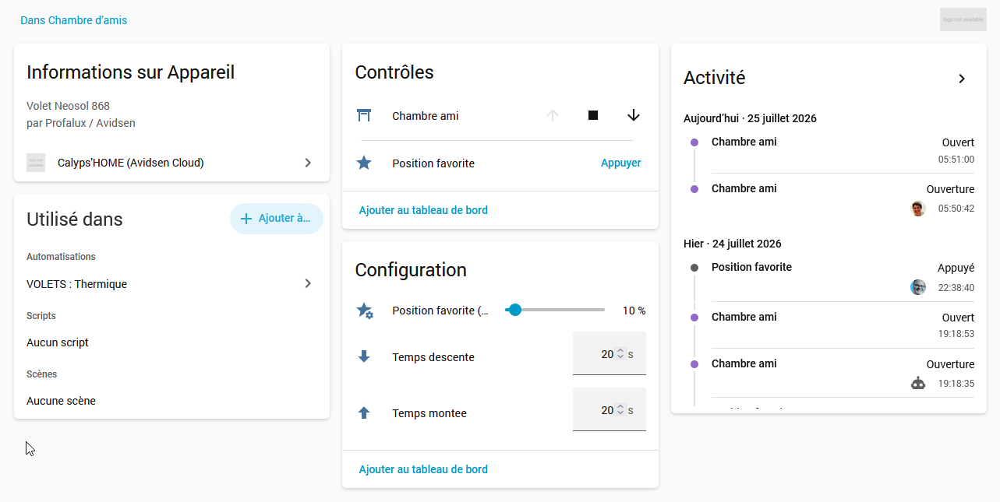
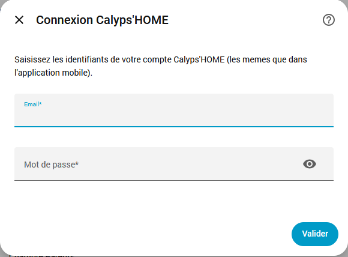

# Calyps'HOME (Avidsen Cloud) for Home Assistant

**English** | [Français](README.md)

[](https://github.com/hacs/integration)
[](https://my.home-assistant.io/redirect/hacs_repository/?owner=akoonet-homeassistant&repository=Calypshome-ha&category=integration)
[](https://github.com/akoonet-homeassistant/Calypshome-ha/releases)
[](LICENSE)

Custom integration to control **Profalux Neosol 868 roller shutters** from Home Assistant through the **Calyps'HOME / Avidsen** cloud, using the same credentials as the mobile app.

The Avidsen cloud does not report the real shutter position: the integration **estimates position with a timer** (per-shutter travel time), which still allows exposing `cover` entities with percentage position and precise position commands.

| | |
|---|---|
| **Domain** | `calypshome` |
| **IoT class** | `cloud_polling` |
| **Configuration** | UI (config flow), no YAML required |
| **Target hardware** | `Rolling_Shutter_Profalux` shutters (Neosol 868) |
| **Languages** | English, French |

---

## ⚠️ Disclaimer

**Install and use at your own risk.** This project is provided "as is", with no guarantee of proper operation, reliability, or fitness for any particular purpose — including actually controlling your shutters correctly. No guarantee is provided either regarding any code modifications that may be made (by the maintainer or by third parties).

Project not affiliated with Avidsen or Profalux. The cloud API used is undocumented and may change or stop working without notice.

---

## Table of contents

- [Disclaimer](#️-disclaimer)
- [Features](#features)
- [Screenshots](#screenshots)
- [Entities created](#entities-created-per-shutter)
- [Installation](#installation)
- [Configuration](#configuration)
- [How position estimation works](#how-position-estimation-works)
- [Repository structure](#repository-structure)
- [Known limitations](#known-limitations)
- [Troubleshooting](#troubleshooting)
- [Contributing](#contributing)
- [License](#license)

---

## Features

- Automatic discovery of the account's shutters (hidden objects are skipped).
- One `cover` entity per shutter with **Open / Close / Stop** and **precise positioning** (0–100%).
- Position estimation from travel time, with an automatic `STOP` when reaching an intermediate position.
- **"Favorite position" button** (`FAV_CALL_1`) to recall the position stored in the motor, created only if the shutter supports it.
- **Configuration sliders** per shutter: up travel time, down travel time, and the percentage matching the favorite position.
- Fully **translated interface (English / French)**, entity names included.
- Restores the last estimated position and settings after a Home Assistant restart.
- JWT token handling (~6 h) with automatic refresh and transparent re-login on expiry.

---

## Screenshots

**Shutters discovered by the integration** — one device per shutter, with its entities:

<p align="center">
  
</p>

**Shutter detail** — controls (open / stop / close, favorite position), travel-time settings and activity history:

<p align="center">
  
</p>

---

## Entities created per shutter

Names are **localized to the Home Assistant language** (English examples below).

| Entity | Type | Purpose |
|--------|------|---------|
| `<shutter>` | Cover | Open / close / stop / position control |
| `<shutter> Favorite position` | Button | Recall the motor's favorite position (`FAV_CALL_1`) |
| `<shutter> Up travel time` | Number (3–120 s) | Full travel time when opening (position estimation) |
| `<shutter> Down travel time` | Number (3–120 s) | Full travel time when closing |
| `<shutter> Favorite position (%)` | Number (0–100%) | Percentage assigned to the favorite position to re-sync the estimate |

The favorite button and slider are only created for shutters exposing the `FAV_CALL_1` action. All these entities are grouped under a single device (`manufacturer`: Profalux / Avidsen, `model`: Volet Neosol 868).

---

## Installation

### Via HACS (recommended)

[](https://my.home-assistant.io/redirect/hacs_repository/?owner=akoonet-homeassistant&repository=Calypshome-ha&category=integration)

Or manually:

1. HACS → ⋮ menu → **Custom repositories**.
2. Add the URL `https://github.com/akoonet-homeassistant/Calypshome-ha`, category **Integration**.
3. Search for **Calyps'HOME**, install, then **restart Home Assistant**.

### Manual installation

1. Copy the `custom_components/calypshome` folder into the `custom_components` directory of your Home Assistant configuration.
2. Restart Home Assistant.

---

## Configuration

1. **Settings → Devices & services → Add integration**.
2. Search for **Calyps'HOME**.
3. Enter the **email** and **password** of your Calyps'HOME account (identical to the mobile app).

<p align="center">
  
</p>

An account can only be configured once. Shutters are then created automatically.

### Setting travel times

Positioning relies entirely on **travel times**. For each shutter:

1. Time a **full opening** and a **full closing** with a stopwatch.
2. Enter these values in the shutter's `Up travel time` / `Down travel time` sliders.

The more accurate the measurement, the more reliable the position estimate. A legacy **Options** menu can also set these times, but the `number` sliders are the recommended method (applied dynamically, no reload).

### Favorite position

The `Favorite position (%)` slider indicates the percentage matching the position stored in the motor. When the favorite button is pressed, the shutter goes to its hardware position and the Home Assistant estimate is re-synced to that value.

---

## How position estimation works

The Avidsen cloud exposes no position feedback. On each command, the integration:

1. sends the action (`OPEN`, `CLOSE`, `STOP`, `FAV_CALL_1`);
2. starts a timer (1 s tick) that interpolates the position from the configured travel time;
3. sends an automatic `STOP` when the target is an intermediate position.

As a result, the displayed position is an **estimate**. Desynchronization can occur after a command issued outside Home Assistant (physical remote, mobile app) or after a power cut. A full open or close re-syncs the estimate.

---

## Repository structure

```
Calypshome-ha/
├── custom_components/
│   └── calypshome/
│       ├── __init__.py
│       ├── api.py
│       ├── button.py
│       ├── config_flow.py
│       ├── const.py
│       ├── cover.py
│       ├── number.py
│       ├── manifest.json
│       ├── brand/
│       │   ├── icon.png
│       │   └── icon@2x.png
│       ├── strings.json
│       └── translations/
│           ├── en.json
│           └── fr.json
├── .github/workflows/  (hacs, hassfest, release)
├── images/
│   ├── config-flow.png
│   ├── device-detail.png
│   └── integration-devices.png
├── .gitignore
├── hacs.json
├── LICENSE
├── README.md          (French)
└── README.en.md       (English)
```

---

## Known limitations

- **Estimated, not measured position**: depends on the accuracy of travel times and can drift if the shutter is operated by other means.
- **Cloud only**: requires access to the Avidsen servers; no local control.
- **Avidsen device limit**: the account is tied to a limited number of devices (`too_much_mobiles` error).

> **About the device identifier**
> Home Assistant registers with Avidsen using a **stable `deviceID` derived from the login** (generated via `uuid5`). It stays identical across restarts, which avoids creating a new device on every startup and triggering the `too_much_mobiles` error. No personal hardware identifier is used or stored.

---

## Troubleshooting

- **"Invalid credentials"**: check email / password in the Calyps'HOME mobile app.
- **"Cannot reach the server"**: network issue or Avidsen cloud unavailability.
- **`too_much_mobiles` error**: Avidsen device limit reached; remove an unused device from the mobile app, or contact support, then reload the integration.
- **Inconsistent position**: run a full open or close to re-sync the estimate, and fine-tune the travel times.

For detailed logs, add to `configuration.yaml`:

```yaml
logger:
  logs:
    custom_components.calypshome: debug
```

---

## Contributing

Issues and pull requests are welcome. Please describe your shutter model and the observed behavior (`debug`-level logs if possible).

---

## License

Distributed under the [MIT](LICENSE) license.
